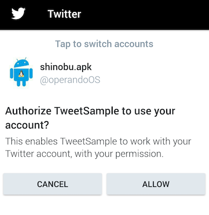

# Twitter Kit Sample

## Documents

* [Log In with Twitter](https://docs.fabric.io/android/twitter/log-in-with-twitter.html)
* [Compose Tweets](https://docs.fabric.io/android/twitter/compose-tweets.html)

## Source Code

* [twitter/twitter-kit-android](https://github.com/twitter/twitter-kit-android/)
 * Twitter KitのSource Code
 * 内部でどんなことやってるのか調べる時に役に立つ
* [twitter-kit-android/samples/app/build.gradle](https://github.com/twitter/twitter-kit-android/blob/master/samples/app/build.gradle)
 * セキュアな値の設定方法をどうするか参考になる
 * [twitter-kit-android/samples/app/fabric.properties.sample](https://github.com/twitter/twitter-kit-android/blob/master/samples/app/fabric.properties.sample)

## Use Case

### Tweetが完了したことをハンドリングしたいよ！

#### 結論

* できるよ！
* でも...ちょっとだけ...ちょっとだけね...面倒だよ？それでも...いいかな？(照

#### Tweetが完了したことをハンドリングするまでの簡単な流れ

絶対この流れってわけでもないけど簡単そうな流れ

1. `TwitterLoginButton`設置
2. `TwitterLoginButton.Callback`の実装
3. Tweetした結果を受け取るためのBroadcastReceiverを実装してManifestに追加
4. ユーザがアプリケーションの認証をOKすると`TwitterSession`ゲット!!
5. 手順 4で取得した`TwitterSession`を`ComposerActivity.Builder`とかにセットしてIntent作成
6. 手順 5で作成したIntentをstartActivity
7. ユーザがTweetを完了する
8. Tweetの結果が手順 4で追加したBroadcastReceiverに通知される
9. BroadcastReceiver内でTweetが正常に行われたかどうかチェックする

#### 詳細な実装フロー

* ますは[Compose Tweets](https://docs.fabric.io/android/twitter/compose-tweets.html)のDocumentの[Results](https://docs.fabric.io/android/twitter/compose-tweets.html#results)を読む
 * ふむふむ...Tweetの結果がBroadcastReceiverで取れるのね
 * これはとりあえずできそうだ！という希望が見えてくる
 * DocumentどおりにBroadcastReceiverの追加をしてみる
 * が、Document内に書いてあるとおり `ComposerActivity` or `TweetUploadService`を使ってTweetした場合に限るという部分が重要
* とにかく簡単にTweetしたいやん。そうしたら`TweetComposer.Builder`でさくっと実装したい気持ち...
 * [Document見るとわかるが](https://docs.fabric.io/android/twitter/compose-tweets.html#compose-a-tweet) `TweetComposer.Builder`を使ってTweetするのはすごく楽
 * だけど上で書いたとおりTweetした結果をBroadcastReceiverで受け取れるのは`ComposerActivity` or `TweetUploadService`を使ってTweetした場合に限る
* じゃ`ComposerActivity` or `TweetUploadService`は何が面倒なのか
 * 実装はあまり難しくないけど`TwitterSession`が必要
 * 要は自身の開発者アカウントの認証を一度ユーザに求める必要がある
 * こんな画面のやつ
 * 
* 実際に認証周りの実装がどんな感じなのかDocument読んでみる
 * [Log In with Twitter](https://docs.fabric.io/android/twitter/log-in-with-twitter.html)
 * 実装は簡単そうだ
 * うーん...ただ手順が増えるのかーという悩みどころ感じ
* じゃ実際に認証周りの実装もできて、`TwitterSession`も手に入った！ってなったら、後は`ComposerActivity.Builder`を使ってTweet画面に遷移する実装をする
 * Documentはこのあたりの読めば楽勝
 * https://docs.fabric.io/android/twitter/compose-tweets.html#intent-builder
